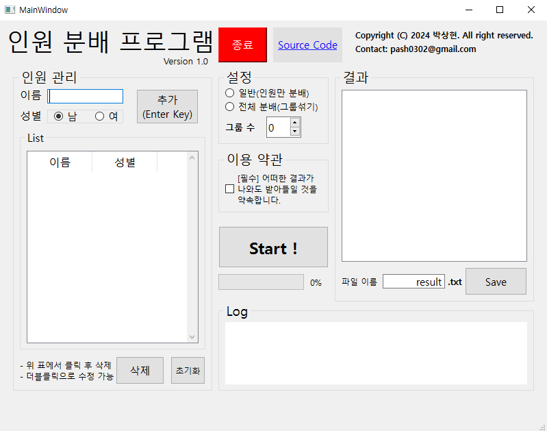
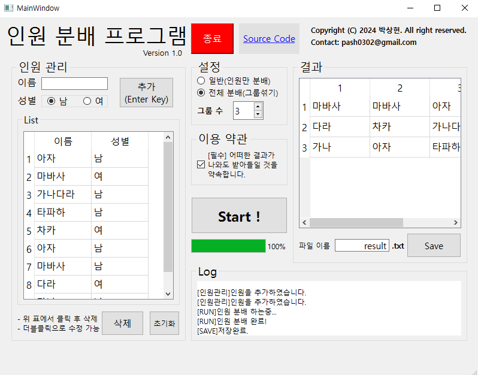
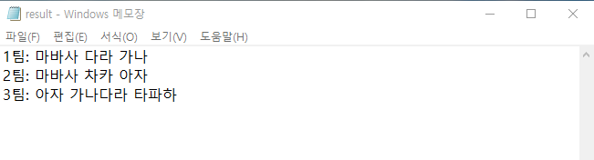

# Group Splitter
인원 분배 프로그램
## How to use?

  

**<인원관리>**  
- 이름 입력 후 엔터키 혹은 `추가`버튼 클릭으로 인원 추가 가능
- 리스트에서 클릭 후 `삭제`버튼으로 삭제 가능
- 리스트에서 더블클릭해 수정 가능  

**<설정>**  
- 일반: 인원 섞고 그룹에 따라 랜덤으로 분배
- 전체 분배: 일반 분배 후 그룹 번호 랜덤으로 재설정  

**<저장>**  
- 파일 이름 입력 후 `Save`버튼 클릭(확장자 입력 X)  

## Example

  

  

